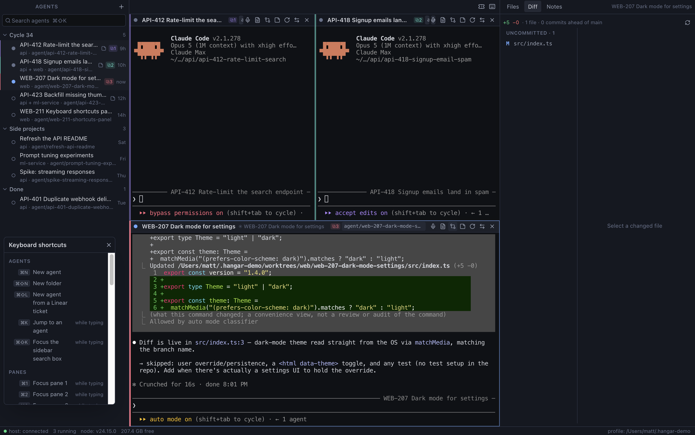

# Hangar

A macOS desktop app for running many Claude Code sessions at once, each in its own git worktree.

Running more than one coding agent quickly becomes a problem of bookkeeping rather than of models.
Terminal tabs multiply, you lose track of which one is waiting for you, and two agents editing the
same checkout collide on the first `git checkout`. Hangar gives each agent a sidebar row with a
status dot, its own worktree and branch, and a terminal you can put in a grid next to three others.
The sessions themselves live in a separate process, so you can rebuild, reload or crash the app
without killing the work. The terminals are the real `claude` CLI — Hangar starts it and watches it,
it does not reimplement it.

It also starts from the other end: **point it at a Linear ticket rather than at a repository.**
Hangar reads what each of your repositories says it is — `package.json`'s description, or the first
real line of its README — and works out which ones the ticket's work actually touches. It comes back
with those repositories and a reason for each, the cycle the ticket belongs to, and a summary, and
fills the New Agent dialog in. You press Create and get the branches, the worktrees and a briefed
agent.



*Five agents in a Linear cycle, three of them open in panes. The focused agent is mid-edit, with its uncommitted diff in the drawer on the right.*

---

## Features

**Sidebar**

- Agents organised into folders that nest to any depth, with drag-and-drop.
- A status dot per agent: working, waiting for you, needs permission, idle, stopped, exited. Hollow
  means there is no process; pulsing means something is happening.
- Bold means unread — Claude finished a turn or asked for something while you were not looking.
- Search (`⌘⇧K`) over agent name, branch and project; a quick switcher on `⌘K`.

**Terminals**

- Up to four panes in a grid. The arrangement follows the count: one, two side by side or stacked,
  three with one spanning the bottom, or 2×2.
- Each pane is a full `claude` session in a login shell, with find (`⌘F`), scrollback and per-pane
  restart, stop and swap controls.
- Per-project "actions" appear in the pane's `⋯` menu. They **type** a command at the prompt and
  stop; you press Enter.

**Worktrees**

- Creating an agent cuts a branch `agent/<slug>` from `origin/<base>` and creates a worktree under
  Hangar's own data directory (`~/.hangar` by default), at `worktrees/<project>/<agent>`. **Your own
  checkout is never written to.**
- An agent can hold up to eight projects. The first is the terminal's working directory; the rest
  are passed to Claude as `--add-dir`.
- Per-project setup for new worktrees: gitignored files to copy (`.env` and friends), directories to
  clone by APFS copy-on-write (`node_modules`), and a post-create command.
- Deleting an agent, or removing one project from an agent, shows you the branch, the worktree path,
  the uncommitted change count and the unmerged commit count first, and makes you type the name when
  anything is at risk.

**Code drawer** (`⌘E`, scoped to the focused pane)

- **Files** — a lazy, gitignore-aware tree and a strictly read-only viewer.
- **Diff** — changed files against the base branch, uncommitted and committed-since-base, with a
  unified diff. It refreshes when the agent stops, when you switch workspace, and every 30 seconds
  while visible.
- **Notes** — autosaving scratch space that the agent can also write to with `hangar note`.

**Linear** (optional; needs Linear connected in Claude Code)

- `⌘⇧L` lists the tickets assigned to you. Pick one — or paste a link or a bare ID like `ACME-123`.
- Hangar reads the ticket and **chooses which of your repositories it touches**, then opens the
  ordinary New Agent dialog already filled in: name, folder (`Cycle <n>`), the projects it picked
  with the reasons, and the ticket summary as notes. Nothing is created until you press Create.
- **How it chooses.** The candidates are your registered projects plus every git repository directly
  inside your repos folder, each one carrying a one-line hint taken from its `package.json`
  description or the first prose line of its README. The choice is made against those descriptions,
  not against directory names, which is why it can route a ticket to a repository you have never
  mentioned to Hangar.
- **The answer is checked, not trusted.** The run gets two read-only Linear tools and nothing else —
  no Bash, no file access, and none of your own Claude settings. Every path it returns is matched
  against the real candidate list; one it invents or edits is dropped and shown to you on a warning
  line rather than quietly used. The ticket's text is summarised as data, never followed as
  instructions.
- Repos it picked that you have not registered yet are added as projects for you.
- **Create a ticket** from the same dialog: type a title and press *Draft with Claude* to fill in
  the description, estimate, priority, team and project, or fill them in yourself. Hangar files
  tickets assigned to you in Backlog, and can do nothing else to Linear.
- A row tagged `agent exists` opens the agent you already have instead of starting a second one.

**Process model**

- Quitting Hangar leaves the agents running. Relaunching reattaches to them with their screens and
  scrollback intact. The File menu also offers *Quit and stop all agents*.
- The window reopens at the size and position it was closed at, and is moved onto a real display if
  that position no longer exists.
- A `hangar` CLI on every agent's `PATH`: `hangar rename`, `hangar note`, `hangar status`, plus
  `hangar doctor` and `hangar host status|stop` for you.
- `⌘/` opens a floating shortcut cheatsheet. It is deliberately not a modal, so the shortcuts it
  documents still work while it is open.

---

## Requirements

- **macOS on Apple silicon.** Developed on macOS 26 on an arm64 Mac. **No x64 or universal build has
  ever been produced**, so an Intel Mac is untested and would need a node-pty repair nobody has
  exercised. There is no Windows or Linux build.
- **Node 24 or newer** (`.nvmrc` says `24`, `package.json` says `>=24`). The session host runs under
  your system Node — the same one that ran `npm install` — so that its native module matches the
  ABI it was built for.
- **The `claude` CLI, installed and signed in**, resolving to a file in an interactive login shell.
  An alias or a shell function alone is not enough.
- **git**.
- For the Linear features only: **Linear connected inside Claude Code**. Run `/mcp` in any Claude
  Code session to connect it; `claude mcp list` should show
  `linear: https://mcp.linear.app/mcp (HTTP) - ✔ Connected`. Hangar reuses that connection. There is
  no separate API key to configure.

---

## Install and run

```bash
npm install
npm run dev
```

`npm run dev` runs the app against a **development profile at `~/.hangar-dev`** — its own data,
socket and worktrees. Every launch prints the profile it chose as its first line.

> **`npm start` and `npm run dev:real` both use the real profile, `~/.hangar`.** Only `npm run dev`
> is the safe one. Set `HANGAR_HOME` yourself if you meant something else.

To build the app:

```bash
npm run app     # → dist/mac-arm64/Hangar.app (unsigned, arm64 only, ~325 MB)
```

The build prints its own install line:

```bash
rm -rf /Applications/Hangar.app && cp -R dist/mac-arm64/Hangar.app /Applications/
```

The build is **unsigned and un-notarised**. macOS does not quarantine an app you built locally, so
opening it on the machine that built it works. If you move it to another Mac, Gatekeeper will refuse
it on first open: right-click the app and choose *Open*, or run
`xattr -dr com.apple.quarantine /Applications/Hangar.app`. That path is untested — see
[Status and limitations](#status-and-limitations).

**The packaged app carries its own copy of `host/`, `cli/` and `shared/`** at
`Hangar.app/Contents/Resources/app`, because that half runs as TypeScript source with no build step.
Editing those directories does not change an installed app; re-run `npm run app` and reinstall.
Running from the checkout (`dev`, `dev:real`, `start`) picks the edits up live.

---

## How it works

```text
Renderer  <->  preload  <->  Main                    Electron
React, xterm.js              git, worktrees, state, window, Linear
          |
          |  NDJSON over a unix socket at HANGAR_HOME/run/host.sock
          v
Session host                                         system Node, detached
node-pty PTYs + a headless xterm mirror per agent
          |
          |  one PTY per agent
          v
$SHELL -il  ->  claude --add-dir ...                 in the agent's worktree
          |
          |  Claude Code hooks, and the agent itself, run:
          v
hangar CLI  ------------------------------------>    back to the session host
```

The split exists for two reasons. Electron's bundled Node and your system Node have different
native-module ABIs, so `node-pty` can only live on one side of the line: it lives in the session
host, which runs under the system Node, and the Electron side ships no native modules at all.
And because the app is expected to be edited by the agents running inside it, the PTYs must outlive
the UI — the host is detached, so a reload, a rebuild or a crash in the app costs you a reconnect
and nothing else. The renderer never touches Node or Electron APIs; it talks to the main process
through a preload bridge whose every payload is schema-validated.

---

## What it costs

Almost nothing in Hangar calls a model. Two things do, both in the Linear dialog, and neither runs
unless you press something — nothing polls, pre-fetches or warms anything up.

| Action | Model call? | Cost |
|---|---|---|
| Reading a ticket and choosing its repos (*Look up*, or clicking a ticket) | Yes — a headless `claude -p` | Measured once at **33 s and $0.22-equivalent** of your Claude subscription usage, on `sonnet`. Times out at 2 minutes |
| *Draft with Claude* on a new ticket | Yes — a headless `claude -p` | A smaller run on the same model; no figure has been measured. Times out at 90 seconds |
| Listing your tickets, paging, refreshing, listing teams and cycles | No | Direct HTTPS to Linear |
| Creating the ticket | No | Direct HTTPS to Linear |
| Everything else in the app | No | — |

The model used for both is `triageModel` in `config.json`, `sonnet` by default. Each run is recorded
in `app.log` with its turn count and cost. The agents you start are, of course, ordinary Claude Code
sessions and cost whatever they cost.

---

## Security posture

- **The two `claude -p` runs are locked down by argv, not by asking the model nicely.** The ticket
  look-up gets exactly two tools, both read-only (`get_issue` and `list_cycles`), one MCP server
  (Linear), no built-in tools at all — no Bash, no file access — and `--permission-mode dontAsk`, so
  anything unlisted is denied rather than prompted for. *Draft with Claude* gets no MCP servers and
  no tools whatsoever. Both run in an empty directory with session persistence off.
- **Your Claude settings are not loaded** into those runs (`--setting-sources ''`), so none of your
  hooks, allow rules or default permission mode apply to them.
- **Ticket text is treated as untrusted.** Repository picks are checked in code against the
  candidate list and anything else is dropped; control and invisible characters are stripped from
  every field; a drafted value that is out of range is discarded on its own rather than taken.
- **The Linear token is borrowed, never stored.** Hangar reads Claude Code's own OAuth entry from
  the login keychain per call, matching on the server URL. It is never written to disk, never
  logged, never sent to the renderer, and never refreshed — refreshing would rotate it and break
  Claude Code's own Linear connection, so an expired login is reconnected there with `/mcp`.
- **There is exactly one code path that writes to Linear**: creating a ticket from the Save button.
  It is never retried automatically — if Linear does not confirm, Hangar tells you to check the list
  rather than risking a duplicate. Four tools are reachable in total, and an unlisted one is refused
  before the keychain is even touched.
- Commands are never built by string interpolation; child processes are spawned with argument
  arrays. Project actions type commands into the terminal instead of running them.

---

## Project layout

| Directory | What is in it | Runs under |
|---|---|---|
| `shared/` | Types, the IPC contract and its zod schemas, the host protocol, pure helpers | everywhere |
| `host/` | The session host daemon: socket server, sessions, PTYs, terminal mirrors | system Node, as `.ts`, no build |
| `cli/` | The `hangar` CLI: command dispatch and the commands themselves | system Node, as `.ts`, no build |
| `bin/hangar` | Shell shim onto `cli/main.ts`, put on each agent's `PATH` | — |
| `src/main/` | Electron main process: `services/` (git, workspace store, worktrees, Claude launch, Linear) and `ipc/` handlers | Electron |
| `src/preload/` | The context bridge — it exposes `invoke`/`on` and nothing else | Electron |
| `src/renderer/` | The React UI: `components/`, `stores/`, `lib/` | Chromium |
| `scripts/` | Launcher, packaging, the node-pty fix-up, and the host smoke test | system Node |
| `docs/` | Runbook, gotchas, release checklist, specs and plans | — |

`shared/`, `host/` and `cli/` run as TypeScript source under Node's native type stripping, so they
avoid syntax that cannot simply be erased. Native modules appear only in `host/`.

---

## Development

```bash
npm run test:unit   # vitest
npm test            # vitest, then a real PTY + real socket smoke test of the host and CLI
npm run typecheck   # tsc over the Node side and the web side
npm run lint        # eslint
npm run build       # electron-vite build
npm run host        # run the session host in the foreground (needs HANGAR_HOME set)
```

Tests sit next to the module they cover as `*.test.ts`. The last recorded full gate run was **1716
tests across 83 files**. Two things are worth knowing before you trust a green run: `vitest` does
not typecheck, so `tsc` is the only gate that catches interface drift; and only `npm test` spawns a
real PTY over a real Unix socket.

**Every behaviour change comes with a test.** That is the house rule, and it is why the suite is the
size it is.

Further reading:

- `docs/RUNBOOK.md` — the user manual, and the most accurate description of what is actually built.
- `docs/GOTCHAS.md` — the platform traps, each with the module that mitigates it. Read it before
  touching anything that spawns a process.
- `docs/RELEASE-CHECKLIST.md` — the gates, and an honest list of what the automated ones cannot see.
- `docs/ARCHITECTURE.md` — the short form: the four runtime units, the protocol, and where state
  lives.
- `CLAUDE.md` — conventions for agents working on this repository.

---

## Status and limitations

A personal project, built for one person's machine and shared as-is. It works, it is tested, and it
is honest about what it has not proved.

- **Unsigned, un-notarised, arm64 only.** No x64 or universal build has ever been produced. No
  auto-update. No Windows or Linux.
- **No GitHub or PR workflow.** Once a worktree exists, git is read-only to Hangar: it counts
  changes, computes merge bases and renders diffs, and never commits, pushes or talks to GitHub.
  Land your work by typing `git` and `gh` in the agent's own terminal. This is a deliberate
  non-goal, not an oversight.
- **No settings UI.** Everything outside the project and agent dialogs is hand-edited in
  `HANGAR_HOME/config.json` and takes effect on restart.
- **The drawer's viewer is read-only** by design, and a renamed file shows as an addition in the
  diff.
- **Removing a project from a running agent** does not take the directory away from the live
  session, which keeps the `--add-dir` it was launched with until it restarts.
- Several behaviours are built and unit-tested but have never been driven by hand — Gatekeeper on
  another machine, terminal reflow on resize, **a whole-cycle run** (every test of it fakes the
  cycle reads and never runs `claude`, and a real run of seven tickets spends about four minutes of
  Claude usage), and a few other Linear paths among them. They are listed,
  individually, under **Known gaps** in `docs/RUNBOOK.md` and in `docs/RELEASE-CHECKLIST.md`. If you
  are evaluating whether to rely on something, read those two sections rather than this one.

---

## Licence

[MIT](LICENSE). Use it, fork it, ship it — the only condition is that the copyright notice travels
with the copies.

Hangar starts the `claude` CLI; it does not bundle or redistribute it. Claude Code is Anthropic's,
under Anthropic's own terms, and you need your own account and subscription to use it.
